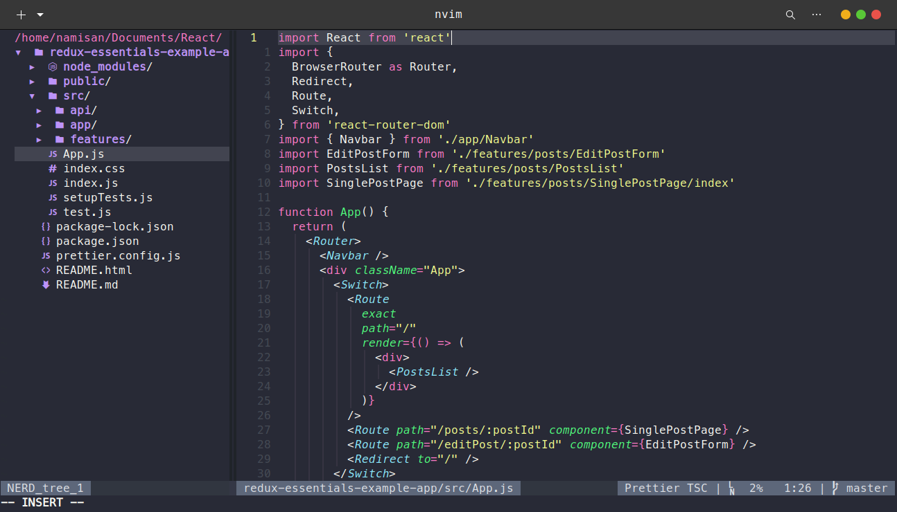
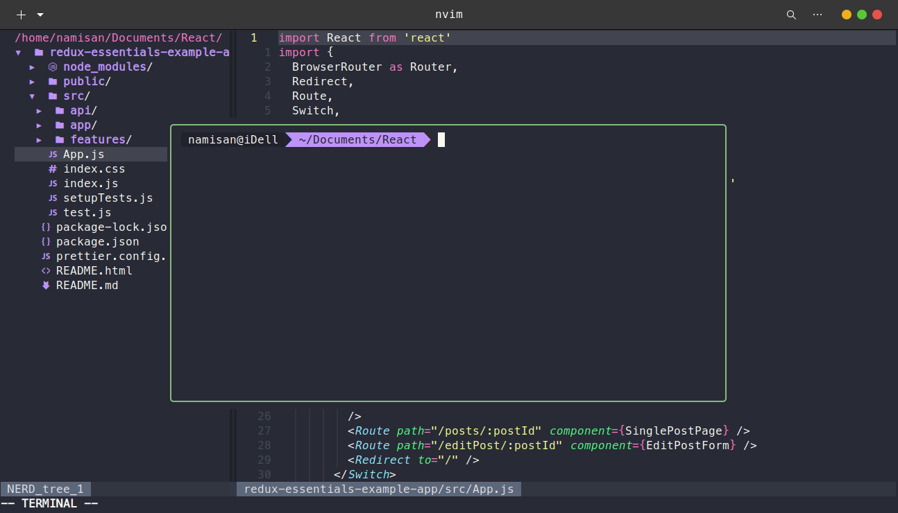
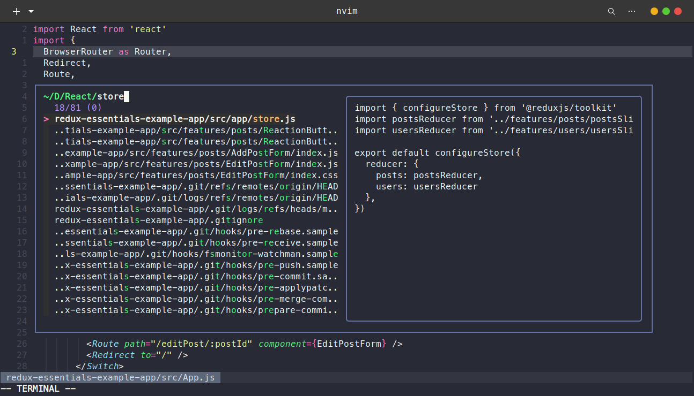
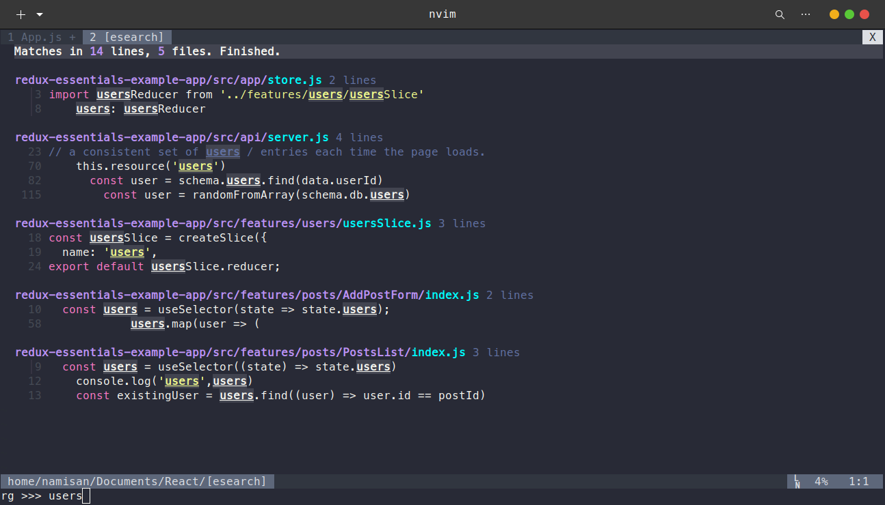

# dot-files

Dotfiles repository

## Shorcuts

- `jk` to normal mode
- `<Leader>` = `Space`
- `<Leader>` + `t` + `c` Create a new tab
- `<Leader>` + `t` + `x` Close a tab
- `<Leader>` + `t` + `p` Go to prev tab
- `<Leader>` + `t` + `n` Go to next tab
- `<Leader>` + `w` + `w` Choosen a window
- `Ctrl` + `t` Open terminal
- `Ctrl` + `\` Split the screen horizotonlly
- `Ctrl` + `ww` Choosen the window
- `Ctrl` + `o` Find a symbol
- `Ctrl` + `s` Save the file
- `Ctrl` + `q` Close a tab
- `Ctrl` + `p` Go to file
- `Ctrl` + `Shift` + `f` Find in file
- `Ctrl` + `j` Go to bottom screen
- `Ctrl` + `h` Go to left screen
- `Ctrl` + `k` Go to top screen
- `Ctrl` + `l` Go to right screen
- `Ctrl` + `b` Toggle the explorer
- `m` 

## Preview

### Explorer
#### `Ctrl` + `b`

### Terminal
#### `Ctrl` + `t`

### Go to file
#### `Ctrl` + `p`

### Find in file
#### `Ctrl` + `Shift` + `f`
